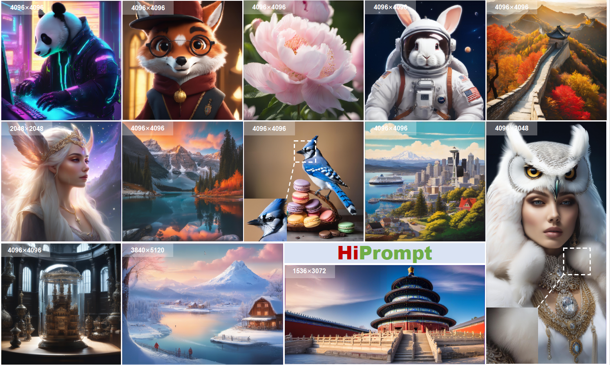

# HiPrompt: Tuning-free Higher-Resolution Generation with Hierarchical MLLM Prompts
<p align="center">
  <a href="https://github.com/Liuxinyv/HiPrompt">Xinyu Liu</a><sup>1</sup>,
  <a href="https://yingqinghe.github.io/">Yingqing He</a><sup>2</sup>, 
  <a href="https://guolanqing.github.io/">Lanqing Guo</a><sup>2</sup>, 
  <a>Xiang Li</a><sup>2</sup>, 
  <a href="https://jxbbb.github.io/">Bu Jin</a><sup>3</sup>, 
  <a>Peng Li</a><sup>1</sup>,
  <a>Yan Li</a><sup>1</sup>,
  <a>Chi-Min Chan</a><sup>3</sup>, 
  <a>Qifeng Chen</a><sup>1</sup>,
   <a>Wei Xue</a><sup>1</sup>,
    <a>Wenhan Luo</a><sup>1</sup>,
   <a>Qingfeng Liu</a><sup>1</sup>,
    <a>QiYike Guo</a><sup>1</sup>
  <br><br>
  <sup>1</sup>Hong Kong University of Science and Technology<br>
  <sup>2</sup>Nanyang Technological University<br>
  <sup>3</sup>Tsinghua University<br>
 <sup>4</sup>University of Chinese Academy of Sciences</span> <br>
</p>
<div align="center">
  <a href="https://liuxinyv.github.io/HiPrompt/"></a> &ensp;
  <a href="https://arxiv.org/abs/2409.02919"></a> &ensp;

</div>


## 🔆 Abstract
 > The potential for higher-resolution image generation using pretrained diffusion models is immense, yet these models often struggle with issues of object repetition and structural artifacts especially when scaling to 4K resolution and higher. We figure out that the problem is caused by that, a single prompt for the generation of multiple scales provides insufficient efficacy. In response, we propose HiPrompt, a new tuning-free solution that tackles the above problems by introducing hierarchical prompts. The hierarchical prompts offer both global and local guidance. Specifically, the global guidance comes from the user input that describes the overall content, while the local guidance utilizes patch-wise descriptions from  MLLMs to elaborately guide the regional structure and texture generation. Furthermore, during the inverse denoising process, the generated noise is decomposed into low- and high-frequency spatial components. These components are conditioned on multiple prompt levels, including detailed patch-wise descriptions and broader image-level prompts, facilitating prompt-guided denoising under hierarchical semantic guidance. It further allows the generation to focus more on local spatial regions and ensures the generated images maintain coherent local and global semantics, structures, and textures with high definition. Extensive experiments demonstrate that HiPrompt outperforms state-of-the-art works in higher-resolution image generation, significantly reducing object repetition and enhancing structural quality.

 
## ⚙️ Setup:
```
conda create -n HiPrompt python=3.9
conda activate HiPrompt 
pip install -r requirements.txt
```
---

## 💫 Inference

```
python hiprompt_llava.py \
    --height 4096 \
    --width 4096 \
    --model_ckpt="stabilityai/stable-diffusion-xl-base-1.0" \
    --validation_prompt "Astronaut on Mars During sunset." \
    --llava true \
    --scale true \
    --cosine_scale_3 0.8 \
    --guidance_scale_2 10.0 \
    --logging_dir ${your-logging-dir} \
```
```
python hiprompt_llava.py \
    --height 4096 \
    --width 4096 \
    --model_ckpt="stabilityai/stable-diffusion-xl-base-1.0" \
    --validation_prompt "Astronaut on Mars During sunset." \
    --llava true \
    --scale true \
    --cosine_scale_3 0.8 \
    --noise_decom true \
    --reduction sum \
    --view_args 2.0 2.0 \
    --views_type low_pass high_pass \
    --guidance_scale_2 10.0 \
    --logging_dir ${your-logging-dir} \
```

```
python hiprompt_share.py \
    --height 4096 \
    --width 4096 \
    --model_ckpt="stabilityai/stable-diffusion-xl-base-1.0" \
    --validation_prompt "A cute corgi on the lawn." \
    --share true \
    --scale true \
    --cosine_scale_3 0.8 \
    --guidance_scale_2 10.0 \
    --logging_dir ${your-logging-dir} \
```
```
python hiprompt_share.py \
    --height 4096 \
    --width 4096 \
    --model_ckpt="stabilityai/stable-diffusion-xl-base-1.0" \
    --validation_prompt "A cute corgi on the lawn." \
    --share true \
    --scale true \
    --cosine_scale_3 0.8 \
    --noise_decom true \
    --reduction sum \
    --view_args 2.0 2.0 \
    --views_type low_pass high_pass \
    --guidance_scale_2 10.0 \
    --logging_dir ${your-logging-dir} \
```
